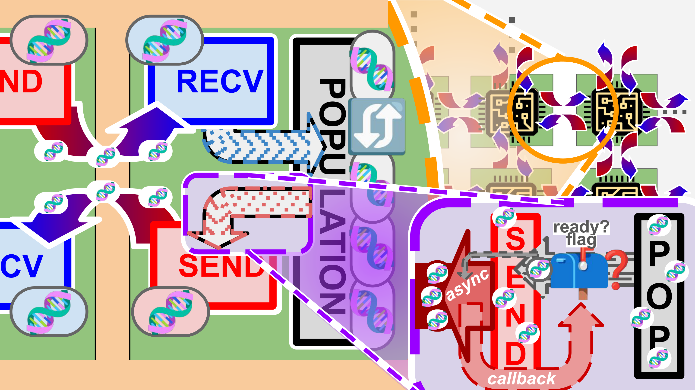
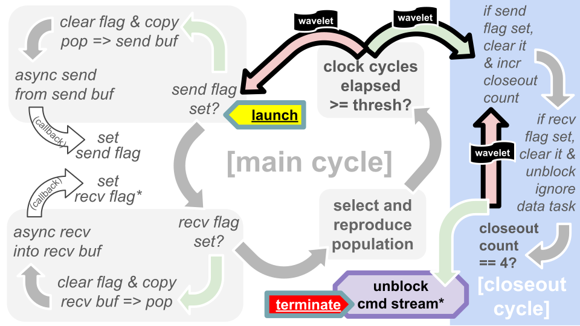

## Kernel Synopsis

This kernel maps an island-model genetic algorithm onto the Wafer-Scale Engine hardware, with each PE serving as an "island" hosting an independent subpopulation.
Within each island, the "fittest" agents are selected via a tournament selection procedure and then reproduced/mutated.
At runtime, "migration" occurs through asynchronous exchange of agent genomes between cardinal neighbors.

-----

</img>

**Figure 1: Kernel data flow.**
*Neighboring PEs exchange agent genomes ("migration") via asynchronous send/receive operations from dedicated buffers, with on-completion callbacks setting "read" flags.*

### Data Flow

Each PE maintains one population buffer, which hosts the genomes of its subpopulation.
PE's also host four send buffers and four receive buffers (one each per neighbor).
The kernel performs eight concurrent asynchronous DSD operations per PE --- an asynchronous send to each neighbor and an asynchronous receive from each neighbor.

Figure 1 summarizes how agent genomes are moved between send/receive/population buffers and exchanged between PE's.
Each asynchronous operation has a corresponding `u8` "completion" flag, which gets set via `local_task` callback.
These flags allow the main update loop to recognize completed requests, transfer genomes to/from the main population buffer, and then open up new requests.
Agent genomes are "immigrated" from the receive buffers to the main population and "emigrated" from the population to the send buffers.

-----

</img>

**Figure 2: Kernel execution flow.**
*Process diagram of per-PE kernel operations.
Italicized items are performed per neighbor.
Green arrows indicate "if yes" and red arrows indicate "if no."
Asterisks (\*'s) denote an extra check that if closeout count equals 4, unblocks corresponding ignore data task for any receive operations with newly set completion flag.*

### Execution Flow

The kernel proceeds through two phases:
1. main update cycle, then
2. closeout cycle.

Each main update cycle roughly corresponds to one "generation" --- it handles a round of immigration, emigration, and selection/mutation.
The closeout cycle is a "cleanup" operation to prevent dangling send operations.
Both cycles are data tasks that loop by dispatching a self-triggering wavelet.
Figure 2 shows program flow within each cycle and during the transition from the main update cycle to the closeout cycle.

The closeout process is necessary because the kernel uses microthread/queue resources also needed by the `memcpy` utilty.
(Only eight queues/microthreads are available to the programmer, all of which are required to back concurrent send/receive operations to four neighbors.)
If dangling send operations leaves these resources in use, `memcpy` operations will crash/hang.
The closeout process accomplishes two primary outcomes:
1. execution continues until all four of the focal PE's send operations have completed successfuly and set their corresponding flag; and
2. transitions the focal PE's receive channel from capacity-limited async DSD operations to an unlimited-capacity no-operation data task.

This second outcome ensures that all *neighboring* PE's will also be able to complete their send operations successfuly --- they'll still have somewhere to send to when the current PE wraps up.
Traffic from neighboring PEs will be accepted into the unblocked no-operation data tasks, which happily ignore said data.

## Platform

Written with Cerebras SDK v1.0.0, targeting WSE-2.
